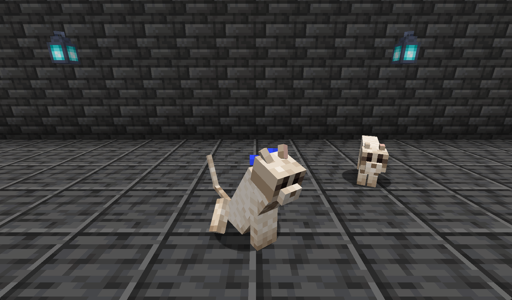

<div align="center">


**Tameable pets modelled on the mascots of Robinhood Chain tokens.**

[](https://www.minecraft.net/)
[](https://neoforged.net/)
[](https://adoptium.net/)
[](LICENSE)
[](../../actions/workflows/build.yml)

<!-- Uncomment each once its project page exists. CurseForge needs the numeric id from the project
     page in place of PROJECT_ID; Modrinth takes the slug. See docs/publishing.md.
[](https://www.curseforge.com/minecraft/mc-mods/hoodcraft)
[](https://modrinth.com/mod/hoodcraft)
-->

</div>

---

## What it adds

A small, self-contained progression that reuses Minecraft's own archaeology loop.


**The Ray** — a Robinhood-green bird that behaves like a parrot: it flies, perches on your
shoulder, sits when told, and takes no fall damage. Two things set it apart. It is tamed with
**wheat seeds** rather than cookies, and unlike a parrot, a tamed pair can be **bred**. Spawns in
forest biomes.

**The Cash Cat** — the crying cat. It sits where it spawns and weeps, which is its whole character.
**Cooked salmon** tames and breeds it, but salmon will not cheer it up: only a **gold ingot** does
that, and only for one Minecraft day, during which it drops the slouch, stops crying and behaves
like an ordinary cat. Feeding it *any* ingot is also a lottery — one time in ten thousand it coughs
up a buried treasure map. Creepers and phantoms fear it exactly as they fear a vanilla cat.

**The Black Feather** — what a Ray drops, and the only feather the Hood Brush can be built from.

**The Hood Brush** — a feather, a gold ingot and a stick. Handles exactly like the vanilla brush
(64 uses, 4.8 seconds a block) but uncovers a different set of things: a nautilus shell, an emerald,
leather boots, a stone hoe — or, at **6.7%**, a pet egg.

**Pet eggs** — brushing is the only way to get one. Place it and wait: 30 minutes to hatch, 15 on
wool, 5 on slime or honey, through three visible cracking stages. The block underneath is re-read at
every stage, so moving an egg mid-hatch changes the time left.

Only pets you cannot otherwise find get an egg. The Ray spawns in forests and is where the Black
Feather comes from, so an egg for it would just be a circular reward; the Cash Cat has one.

**Suspicious gravel in ancient cities** — 30% of the loose cobbled deepslate on their floors, so the
brush has somewhere new to be used. Vanilla's suspicious sand still works as it always did.

## Screenshots




*The Cash Cat, sitting and crying. The one behind it has been fed a gold ingot.*

| | |
|:--:|:--:|
|  |  |
| **The Ray** — 6 hearts, tamed with wheat seeds | **The Hood Brush** — over suspicious sand and gravel |
|  |  |
| **Hatch stages** on honey, slime and wool | **Black Feather, Hood Brush, Cash Cat Egg** |

## Installing

1. Install [NeoForge 21.1.x](https://neoforged.net/) for Minecraft **1.21.1**.
2. Drop `hoodcraft-x.y.z.jar` into your `mods` folder.

No other mods are required. The Ray's model was rebuilt against vanilla rather than copied, so
there is **no dependency on Citadel** even though the geometry originates in a mod that needs it.
The Cash Cat is built on vanilla's own cat mesh, reposed.

## Reference

| | |
| --- | --- |
| Ray | 6 hearts · wheat seeds to tame (1 in 3) and breed · forest biomes |
| Cash Cat | 10 hearts · cooked salmon to tame (1 in 3) and breed · plains, savanna, taiga |
| Cheering a Cash Cat | one gold ingot, lasts one Minecraft day (24,000 ticks) |
| Treasure map | any ingot, 1 in 10,000 |
| Hood Brush durability | 64 uses |
| Brushing time | 96 ticks (4.8 s) |
| Pet egg from brushing | 6.7% — weight 1 of 15, vanilla's own sniffer-egg odds |
| Egg hatch | 30 min, 15 on wool, 5 on slime or honey |
| Suspicious gravel | 30% of ancient-city cobbled deepslate |

Unlike a vanilla brush, the Hood Brush also works on suspicious blocks you placed yourself — handy
for testing, and no exploit, since neither block can be obtained in survival at all. A block that
has already been brushed keeps whatever it rolled, so results cannot be re-rolled.

## Building from source

```bash
./gradlew build          # jar lands in build/libs/
./gradlew runClient      # dev client
./gradlew runServer      # dev server
```

Requires JDK 21. See [CONTRIBUTING.md](CONTRIBUTING.md) for the asset pipeline, the in-game
verification scripts, and what is involved in adding another pet.

## Licence and credits

**[GPL-3.0-only](LICENSE)** — inherited, not chosen.

The Ray's model geometry and its bird calls derive from the Blue Jay in
**[Alex's Mobs](https://github.com/Alex-the-666/AlexsMobs)** by Alexthe666, which is GPL-3.0. That
licence is copyleft, so anything built from it carries the same terms, and this mod does too.

The Cash Cat's geometry is vanilla's cat, reposed, and it borrows vanilla's cat sounds rather than
shipping its own.

Mechanics are mirrored from vanilla Minecraft's brush, sniffer egg, parrot and cat.
