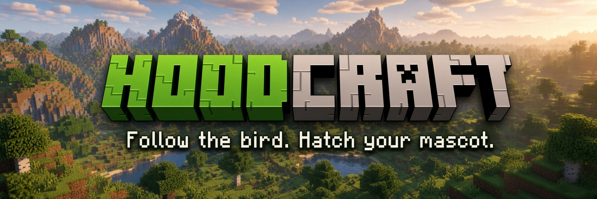
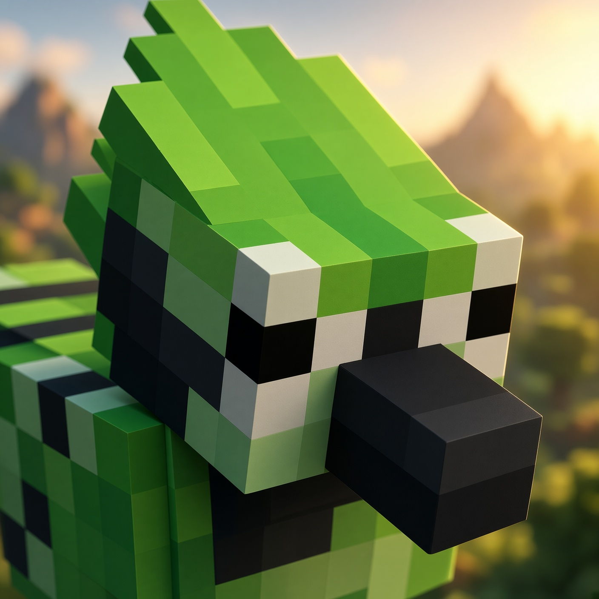
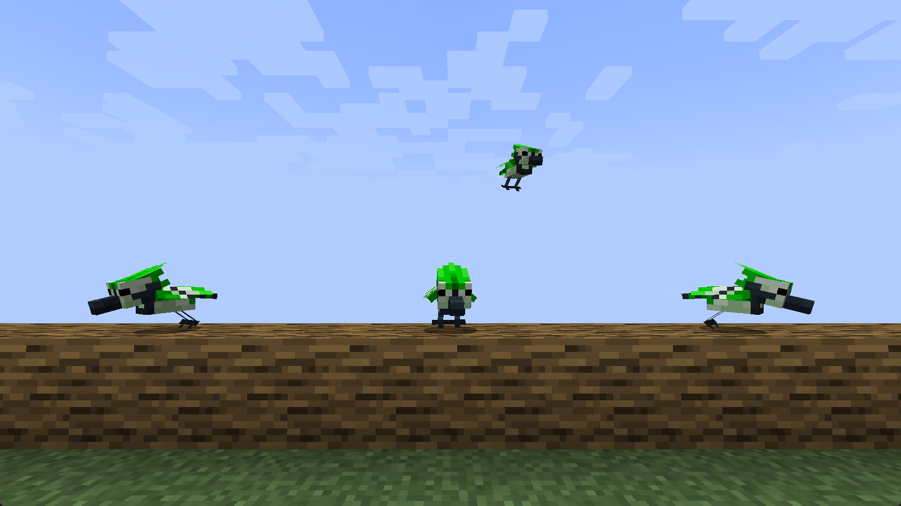
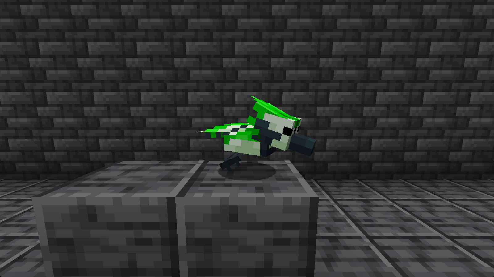
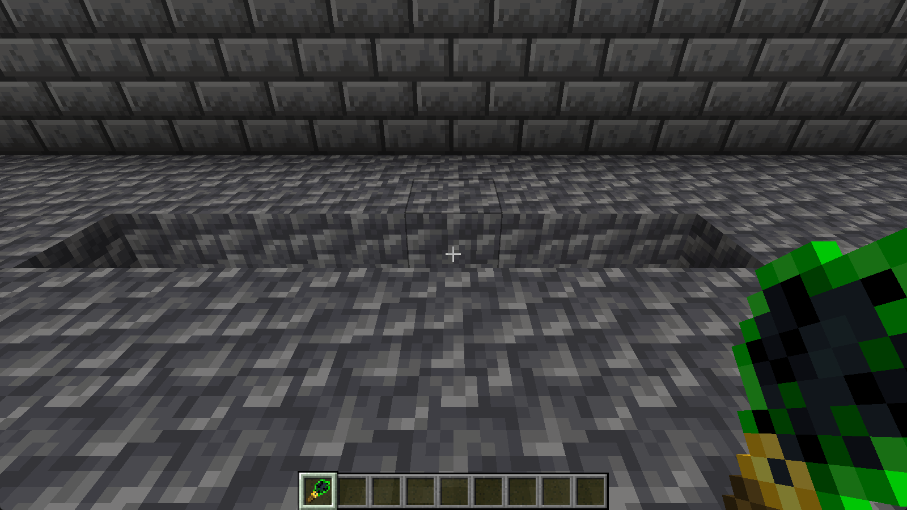
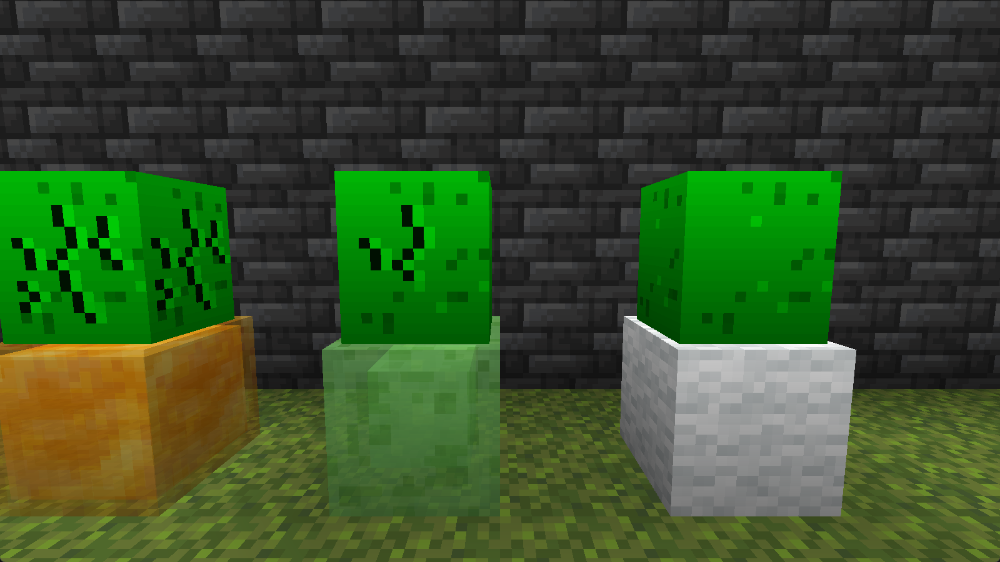
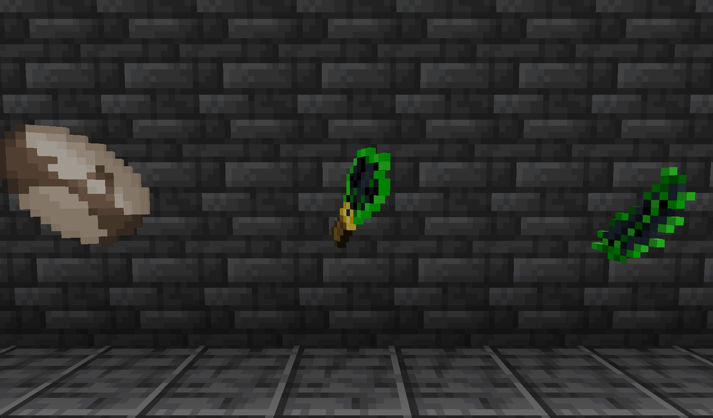

<div align="center">



**Tameable pets modelled on the mascots of Robinhood Chain tokens.**

[](https://www.minecraft.net/)
[](https://neoforged.net/)
[](https://adoptium.net/)
[](LICENSE)
[](../../actions/workflows/build.yml)

<!-- Add once the CurseForge project exists — replace PROJECT_ID with the numeric id from the project page:
[](https://www.curseforge.com/minecraft/mc-mods/hoodcraft)
-->

</div>

---

## What it adds

A small, self-contained progression that reuses Minecraft's own archaeology loop.



**The Robin** — a Robinhood-green bird that behaves like a parrot: it flies, perches on your
shoulder, sits when told, and takes no fall damage. Two things set it apart. It is tamed with
**wheat seeds** rather than cookies, and unlike a parrot, a tamed pair can be **bred**. Spawns in
forest biomes.

**The Black Feather** — what a Robin drops, and the only feather the Hood Brush can be built from.

**The Hood Brush** — a feather, a copper ingot and a stick. Handles exactly like the vanilla brush
(64 uses, 4.8 seconds a block) but uncovers a different set of things: a nautilus shell, an emerald,
leather boots or a stone hoe.

**Suspicious gravel in ancient cities** — 30% of the loose cobbled deepslate on their floors, so the
brush has somewhere new to be used. Vanilla's suspicious sand still works as it always did.

> [!NOTE]
> **The pet egg is work in progress and cannot be obtained.** With one mob, and one that already
> spawns in the world, an egg for it would be a circular reward. The block, its three hatch stages
> and its 30 / 15 / 5-minute substrate timing are all built and tested — it is simply held back
> until there is a second pet worth finding.

## Screenshots



| | |
|:--:|:--:|
|  |  |
| **The Robin** — 6 hearts, tamed with wheat seeds | **The Hood Brush** — over suspicious sand and gravel |
|  |  |
| **Hatch stages** on wool, slime and honey *(WIP)* | **Black Feather, Hood Brush, Robin Egg** |

## Installing

1. Install [NeoForge 21.1.x](https://neoforged.net/) for Minecraft **1.21.1**.
2. Drop `hoodcraft-x.y.z.jar` into your `mods` folder.

No other mods are required. The Robin's model was rebuilt against vanilla rather than copied, so
there is **no dependency on Citadel** even though the geometry originates in a mod that needs it.

## Reference

| | |
| --- | --- |
| Robin health | 6 (3 hearts) |
| Taming | wheat seeds, 1 in 3 per seed |
| Breeding | wheat seeds |
| Spawns in | forest biomes |
| Hood Brush durability | 64 uses |
| Brushing time | 96 ticks (4.8 s) |
| Egg hatch *(WIP)* | 30 min, 15 on wool, 5 on slime or honey |
| Suspicious gravel | 30% of ancient-city cobbled deepslate |

Unlike a vanilla brush, the Hood Brush also works on suspicious blocks you placed yourself — handy
for testing, and no exploit, since neither block can be obtained in survival at all. A block that
has already been brushed keeps whatever it rolled, so results cannot be re-rolled.

## Building from source

```bash
./gradlew build          # jar lands in build/libs/
./gradlew runClient      # dev client
./gradlew runServer      # dev server
```

Requires JDK 21. See [CONTRIBUTING.md](CONTRIBUTING.md) for the asset pipeline, the in-game
verification scripts, and what is involved in adding another pet.

## Licence and credits

**[GPL-3.0-only](LICENSE)** — inherited, not chosen.

The Robin's model geometry and its bird calls derive from the Blue Jay in
**[Alex's Mobs](https://github.com/Alex-the-666/AlexsMobs)** by Alexthe666, which is GPL-3.0. That
licence is copyleft, so anything built from it carries the same terms, and this mod does too.

Mechanics are mirrored from vanilla Minecraft's brush, sniffer egg and parrot.
